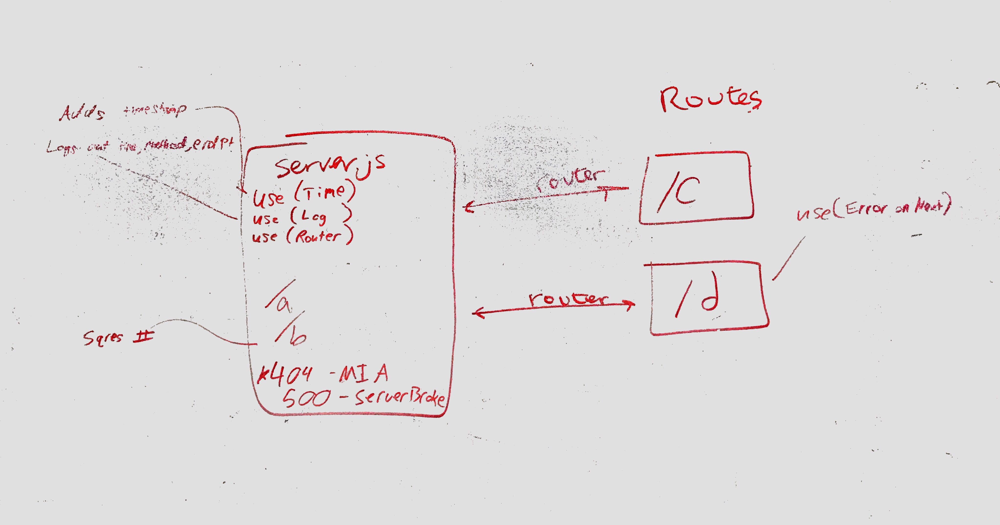

# LAB: 07

## LAB: Middleware

### Author: Adrienne Easton

### Links and Resources
* [submission PR](https://github.com/401-advanced-javascript-aeaston/lab-07-middleware/pull/1)
* [travis]

### Modules
#### `get`
##### Exported Values and Methods
* errorHandler();

### Setup
* To install necessary dependancies type 'npm i'
  
#### Tests
* To run test type 'npm test'.

